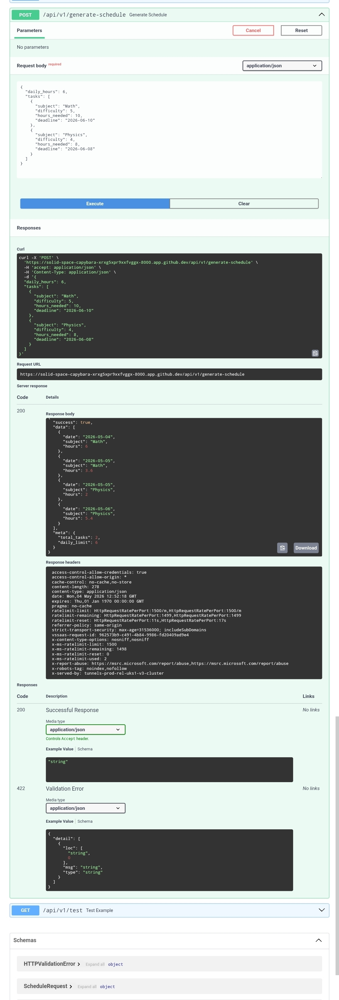

# 📚 Smart Study Planner (AI-Powered)

An intelligent full-stack system that generates optimized study schedules based on subject difficulty, deadlines, and available daily time.

Built to demonstrate real-world **software engineering, algorithm design, and system architecture skills**.

---

## 🎥 Demo

### 📸 Dashboard Preview

---

### 🎬 Demo Video
▶️ [Watch Demo](assets/demo.mp4)

---

## 🚀 Live Concept

The system takes raw study tasks and transforms them into an optimized, balanced study plan using:
- Priority-based scheduling
- Greedy allocation algorithm
- Load balancing optimization

---

## 🧠 Key Features

- 📊 AI-like scheduling engine (heuristic-based)
- ⚙️ Smart prioritization (difficulty + deadline)
- 📅 Automatic daily schedule generation
- ⚖️ Workload balancing to avoid burnout
- 🌐 Full REST API with FastAPI
- 🎨 Simple interactive frontend UI
- 🧪 Unit + integration testing
- 📄 Clean system architecture documentation

---

## 🏗️ Tech Stack

**Backend:**
- FastAPI
- Python 3.11
- Pydantic
- Uvicorn

**Frontend:**
- HTML
- CSS
- JavaScript

**Testing:**
- Pytest

**Dev Tools:**
- GitHub Actions (CI-ready)
- Git

---

## ⚙️ System Architecture

Frontend → API Layer → Scheduler Engine → Optimizer → Response

---

## 📊 Algorithm Overview

### Priority Scoring:
Urgency = (Difficulty × 2) + (100 / Days Left)

### Scheduling:
- Greedy task allocation
- Daily hour distribution

### Optimization:
- Load balancing
- Cognitive fatigue reduction

---

## 📦 Installation & Run

### Clone repo
git clone https://github.com/your-username/smart-study-planner-ai.git
cd smart-study-planner-ai

### Install dependencies
pip install -r requirements.txt

### Run backend
uvicorn backend.app:app --reload

### Open frontend
frontend/index.html

---

## 🧪 Run Tests

pytest tests/

---

## 🌐 API Endpoints

- GET /health → Health check  
- POST /api/v1/generate-schedule → Generate study plan  
- GET /api/v1/test → Test endpoint  

Full API docs: /docs/api.md

---

## 📁 Project Structure

backend/  
frontend/  
docs/  
tests/  
data/  
scripts/  

---

## 🎯 Purpose

This project demonstrates:
- Problem-solving skills  
- Algorithm design  
- Full-stack development  
- System design thinking  
- Clean architecture  

---

## 🚀 Future Improvements

- ML-based scheduling  
- Authentication system  
- PostgreSQL integration  
- Mobile app version  
- Personalized learning engine  

---

## 👨‍💻 Author

Kareem Mostafa  
Computer Engineering Applicant  

---

## 📌 Note

This is a full software system design project combining backend, frontend, and algorithm engineering.
